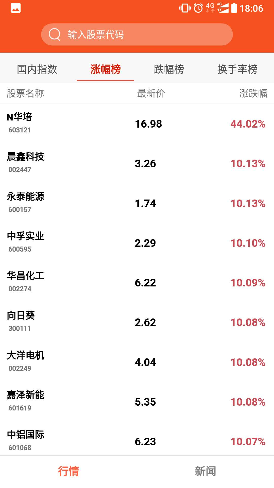

# RNStock
这是一个学习React Native的练手项目。

项目使用到的API:


```
https://interface.sina.cn
http://stockapi.apon.me
http://codepush.apon.me
```

使用React Native相关的各种库：

```
"dependencies": {
    "querystring": "^0.2.0",
    "react": "16.6.3",
    "react-native": "0.57.8",
    "react-native-code-push": "^5.5.1",
    "react-native-gesture-handler": "^1.0.12",
    "react-native-scrollable-tab-view": "^0.10.0",
    "react-native-super-grid": "^2.4.4",
    "react-navigation": "^3.0.9",
    "react-redux": "^6.0.0",
    "redux": "^4.0.1",
    "redux-actions": "^2.6.4",
    "redux-logger": "^3.0.6",
    "redux-saga": "^0.16.2"
  }
```

运行项目：


```
$ git clone git@github.com:apon/rnstock.git
$ cd rnstock
$ npm install
$ react-native run-android
```

| 首页        |      首页           |  搜索 |
| :-------------: |:-------------:| :------------:|
|      |  |  |
| 个股详情        |      新闻           |  新闻详情  |
|      |  |  |


